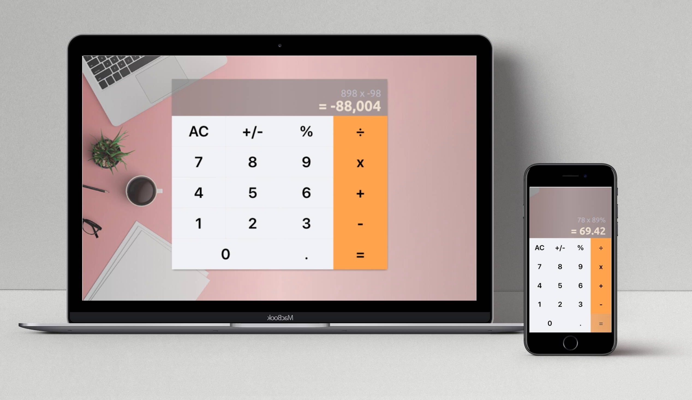

<h1 align="center">Welcome to my-calculator 👋</h1>
<p align="center">
  
  <a href="https://github.com/kelvin8773/my-calculator/blob/master/LICENSE" target="_blank">
    
  </a>
  <a href="https://twitter.com/Kelvin9877" target="_blank">
    
  </a>
  <a href="https://app.netlify.com/sites/my-calculator-web/deploys" target="_blank">
    
  </a>
</p>

[](https://calculator.kelvinliang.cn/)

> An small calculator app to learn React from the beginning.

### ✨ [Demo Link](https://calculator.kelvinliang.cn/)

## Main Features
* Basic mathematical calculations;
* Support dynamically change (+/- sign/ % percentages);
* Show formula & result in 2 lines;
* Support continue calculation (result keep roll to next calculation);
* fit to all size screen

## Know issue and planned features
* Does not yet support large numbers (Visually, neither formulas nor results can be too long);
* History of calculations;
* keyboard input support for desktop users;
* Adding Test Units;

### Tech Stacks
* SASS
* ES6
* ReactJS

I use [Create-React-App](https://github.com/facebook/create-react-app) to generate a react app template as the starting point of this project. 
More info about template and how to deploy it to Heroku, you can reference below: 
* [Create-React-App Docs](./docs/create-react-app.md)
* [How to deploy React to Heroku](https://github.com/mars/create-react-app-buildpack)


## Install

```sh
yarn install
```

## Usage

```sh
yarn start
```

## Run tests

```sh
yarn test
```

## Production Build

```sh
yarn build
```

## Author

👤 **Kelvin Liang**

* Website: https://medium.com/@Kelvin9877
* Twitter: [@kelvin9877](https://twitter.com/kelvin9877)
* Github: [@kelvin8773](https://github.com/kelvin8773)
* LinkedIn: [@kelvin9877](https://linkedin.com/in/kelvin9877)
* Email: [kelvinliang@yandex.com](mailto:kelvinliang@yandex.com)

**I am available for hire/looking for next dev position.**

## Show your support

Give a ⭐️ if this project helped you!

## 📝 License

This project is [MIT](https://github.com/kelvin8773/my-calculator/blob/master/LICENSE) licensed.

***
_This README was generated with ❤️ by [readme-md-generator](https://github.com/kefranabg/readme-md-generator)_